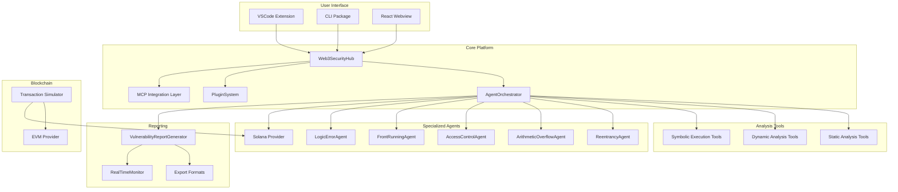
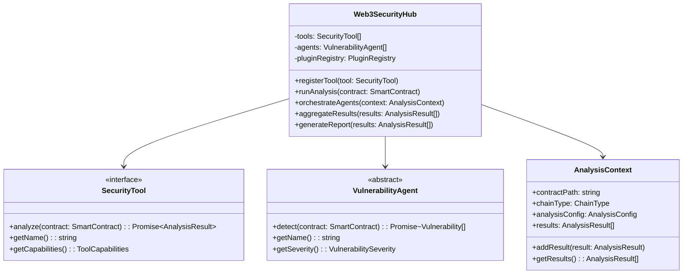
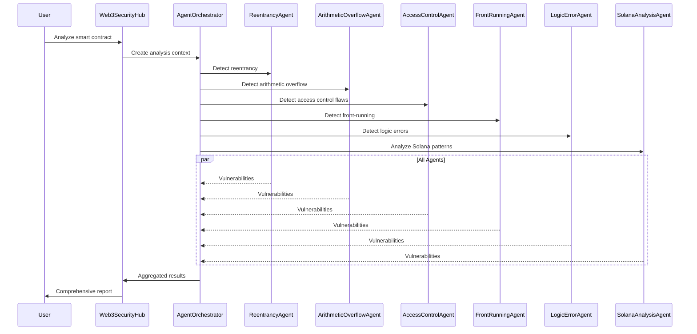
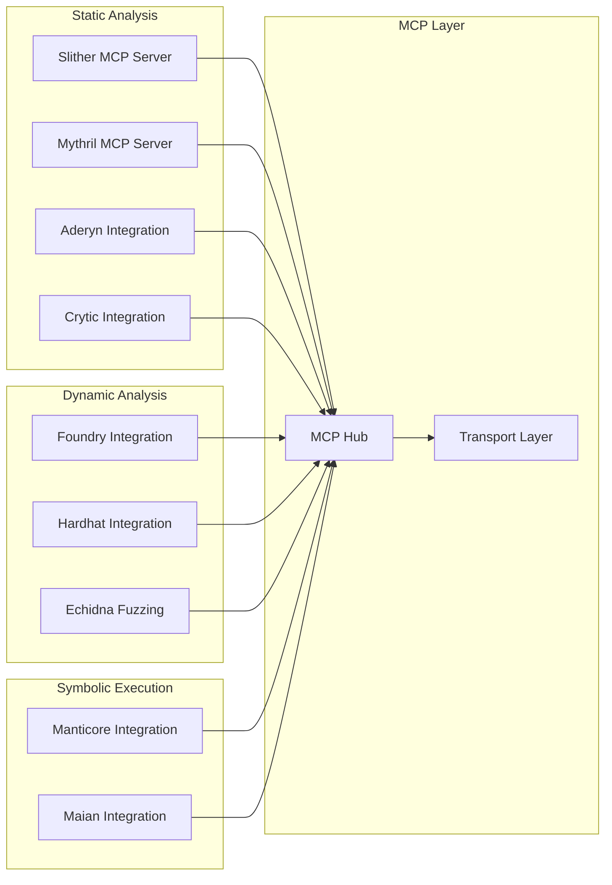
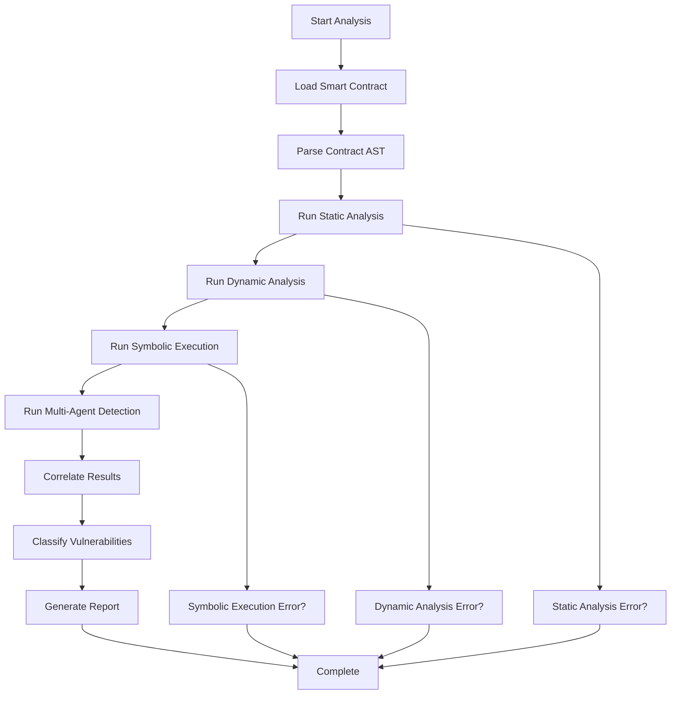
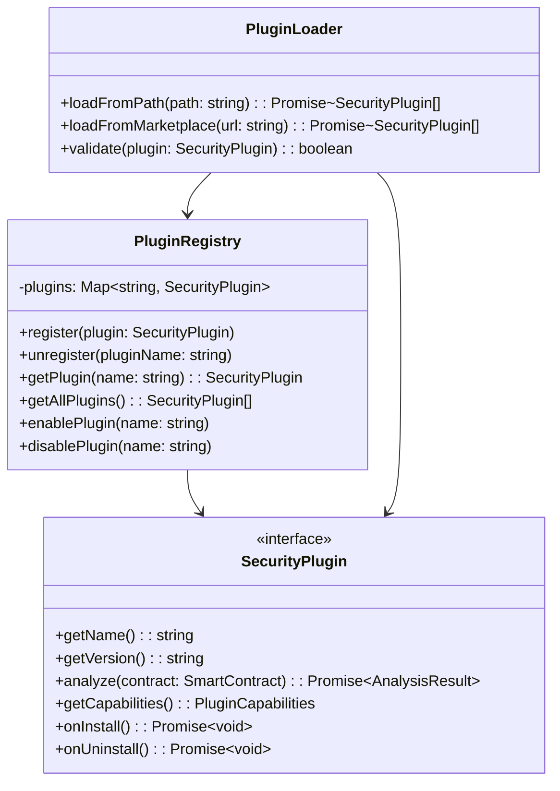
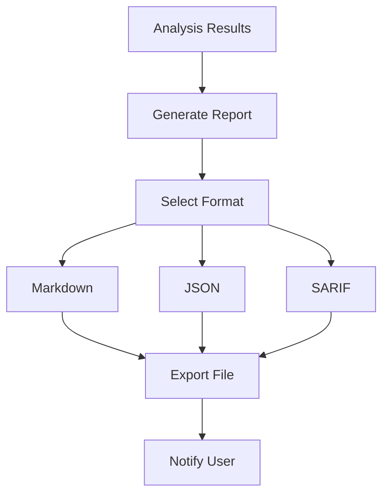
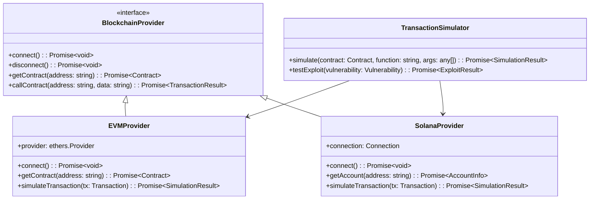

# Kilo Code Web3 Security Platform Architecture

## Executive Summary

This document outlines the comprehensive architecture for transforming Kilo Code into the ultimate AI-driven platform for Web3 smart contract auditing and bug bounty hunting. The architecture leverages the existing MCP (Model Context Protocol) infrastructure to create a modular, extensible multi-agent system that integrates industry-leading static and dynamic analysis tools.

## High-Level Architecture



## Directory Structure

```
src/
├── services/
│   └── web3-security/              # kilocode_change - new directory
│       ├── Web3SecurityHub.ts      # Main orchestrator
│       ├── VulnerabilityDetector.ts   # Base detector class
│       ├── VulnerabilityReport.ts    # Report schemas
│       ├── SecurityAnalysisContext.ts # Analysis state
│       ├── agents/                   # Sub-agents
│       │   ├── ReentrancyDetectionAgent.ts
│       │   ├── ArithmeticOverflowDetectionAgent.ts
│       │   ├── AccessControlFlawDetectionAgent.ts
│       │   ├── FrontRunningDetectionAgent.ts
│       │   ├── LogicErrorDetectionAgent.ts
│       │   └── SolanaAnalysisAgent.ts
│       ├── integrations/              # Tool integrations
│       │   ├── slither/           # Slither MCP wrapper
│       │   ├── mythril/           # Mythril MCP wrapper
│       │   ├── aderyn/            # Aderyn integration
│       │   ├── crytic/             # Crytic integration
│       │   ├── foundry/            # Foundry integration
│       │   ├── hardhat/            # Hardhat integration
│       │   ├── echidna/            # Echidna fuzzing
│       │   ├── manticore/          # Manticore symbolic exec
│       │   └── maian/              # Maian symbolic exec
│       ├── blockchain/                # Blockchain providers
│       │   ├── BlockchainProvider.ts
│       │   ├── EVMProvider.ts
│       │   ├── SolanaProvider.ts
│       │   └── TransactionSimulator.ts
│       ├── reporting/                 # Reporting pipeline
│       │   ├── VulnerabilityReportGenerator.ts
│       │   ├── MarkdownGenerator.ts
│       │   ├── JSONExporter.ts
│       │   └── SARIFGenerator.ts
│       └── plugins/                   # Plugin system
│           ├── SecurityPlugin.ts
│           ├── PluginRegistry.ts
│           └── PluginLoader.ts
└── core/
    └── tools/
        └── web3-security/           # kilocode_change - new directory
            ├── AnalyzeSmartContractTool.ts
            ├── RunFuzzingTestTool.ts
            ├── RunSymbolicExecutionTool.ts
            ├── GenerateVulnerabilityReportTool.ts
            └── OnChainInteractionTool.ts

packages/
└── core-schemas/
    └── src/
        └── web3-security/          # kilocode_change - new directory
            ├── vulnerability.ts          # Vulnerability schemas
            ├── analysis.ts              # Analysis result schemas
            ├── config.ts                # Security configuration
            └── plugins.ts               # Plugin schemas

webview-ui/
└── src/
    └── components/
        └── web3-security/           # kilocode_change - new directory
            ├── SecurityDashboard.tsx
            ├── VulnerabilityViewer.tsx
            ├── AgentStatusMonitor.tsx
            ├── AnalysisResultsPanel.tsx
            └── PluginManager.tsx

cli/
└── src/
    └── commands/
        └── web3-security/           # kilocode_change - new directory
            ├── audit.ts
            ├── report.ts
            └── plugin.ts
```

## Core Components

### 1. Web3SecurityHub

The central orchestrator that coordinates all security analysis activities.



### 2. Multi-Agent Orchestration

The AgentOrchestrator coordinates multiple specialized sub-agents for comprehensive vulnerability detection.



### 3. Tool Integration Architecture

Static and dynamic analysis tools are integrated via MCP server wrappers.



### 4. Vulnerability Detection Pipeline



### 5. Plugin System Architecture



### 6. Reporting Pipeline



### 7. On-Chain Interaction Layer



## Vulnerability Detection Patterns

### Supported Vulnerability Types

| Category       | Vulnerability              | Severity | Detection Methods                                       |
| -------------- | -------------------------- | -------- | ------------------------------------------------------- |
| Reentrancy     | Reentrancy Attack          | High     | Static analysis, symbolic execution, runtime monitoring |
| Arithmetic     | Integer Overflow/Underflow | Critical | Static analysis, fuzzing, symbolic execution            |
| Access Control | Missing Access Control     | High     | Static analysis, pattern matching                       |
| Front-running  | Front-running/MEV          | Medium   | Transaction simulation, mempool monitoring              |
| Logic Errors   | Business Logic Flaws       | High     | Symbolic execution, formal verification                 |
| Gas Issues     | Gas Optimization           | Low      | Static analysis, gas profiling                          |
| Storage        | Storage Collision          | Medium   | Static analysis, symbolic execution                     |
| Delegatecall   | Unsafe Delegatecall        | High     | Static analysis, control flow analysis                  |
| Timestamp      | Timestamp Dependence       | Low      | Static analysis                                         |
| Tx.origin      | Tx.origin Authentication   | High     | Static analysis, pattern matching                       |

### Multi-Agent Detection Strategy

Each vulnerability type has a dedicated sub-agent that can:

1. **Analyze contract code** using multiple techniques
2. **Correlate findings** across different analysis tools
3. **Prioritize vulnerabilities** by severity and exploitability
4. **Generate exploit scenarios** for testing
5. **Provide remediation** suggestions

## Integration with Existing MCP Infrastructure

The Web3 Security Platform leverages Kilo Code's existing MCP infrastructure:

1. **MCP Server Wrappers**: Each security tool is wrapped as an MCP server
2. **Tool Discovery**: Automatic discovery of security tool capabilities
3. **Resource Management**: Shared resources across security tools
4. **Configuration**: Unified configuration for all security tools
5. **Lifecycle Management**: Start/stop/restart security tools via MCP

### Example MCP Server Configuration

```json
{
	"mcpServers": {
		"slither": {
			"type": "stdio",
			"command": "python3",
			"args": ["-m", "slither.mcp.server"],
			"cwd": "/path/to/slither",
			"timeout": 300,
			"alwaysAllow": ["analyze_contract", "list_detectors"]
		},
		"mythril": {
			"type": "stdio",
			"command": "myth",
			"args": ["--mcp"],
			"timeout": 600
		}
	}
}
```

## Implementation Phases

The implementation is divided into 16 phases for systematic development:

### Phase 1-4: Foundation

- Architecture design
- Core schemas and types
- Plugin system design
- Multi-agent orchestration

### Phase 5-6: Static Analysis Integration

- Slither, Mythril, Aderyn, Crytic integrations
- Unified result normalization

### Phase 7-8: Dynamic Analysis Integration

- Foundry, Hardhat, Echidna integrations
- Fuzz test aggregation

### Phase 9-10: Symbolic Execution Integration

- Manticore, Maian integrations
- Result correlation

### Phase 11-12: Multi-Agent & Tools

- Specialized vulnerability detection agents
- VSCode extension tools

### Phase 13-16: Reporting, UI, CLI, Testing, Release

- Vulnerability reporting pipeline
- WebUI components
- CLI commands
- Configuration
- Testing & documentation
- Performance optimization
- Release & deployment

## Configuration Schema

### Analysis Configuration

```typescript
interface AnalysisConfig {
	// Tool selection
	enabledTools: string[]
	toolTimeouts: Record<string, number>

	// Vulnerability detection
	vulnerabilityTypes: VulnerabilityType[]
	severityThreshold: VulnerabilitySeverity
	falsePositiveThreshold: number

	// Chain-specific
	chainType: ChainType
	chainConfig: ChainConfig

	// Analysis depth
	analysisDepth: "quick" | "standard" | "deep"
	maxAnalysisTime: number

	// Reporting
	reportFormat: "markdown" | "json" | "sarif"
	includeExploitScenarios: boolean
	includeRemediation: boolean
}

interface ChainConfig {
	// EVM-specific
	solidityVersion?: string
	optimizerRuns?: number
	evmVersion?: string

	// Solana-specific
	anchorVersion?: string
	framework?: "anchor" | "native"
}
```

### Plugin Configuration

```typescript
interface PluginConfig {
	name: string
	version: string
	enabled: boolean
	priority: number
	capabilities: PluginCapabilities
	config: Record<string, unknown>
}

interface PluginCapabilities {
	vulnerabilityTypes: VulnerabilityType[]
	supportedChains: ChainType[]
	analysisMethods: AnalysisMethod[]
}
```

## Performance Considerations

1. **Caching**: Analysis results cached to avoid redundant scans
2. **Parallel Execution**: Multiple tools run in parallel where possible
3. **Incremental Analysis**: Only analyze changed code in large projects
4. **Progress Reporting**: Real-time progress updates for long-running analyses
5. **Resource Management**: Limit concurrent analyses based on system resources

## Security Considerations

1. **Sandboxing**: All tool executions run in isolated environments
2. **Input Validation**: Strict validation of contract code and parameters
3. **Output Sanitization**: Sanitized output to prevent injection attacks
4. **Plugin Verification**: Cryptographic verification of plugin authenticity
5. **Audit Logging**: Comprehensive logging of all security analyses

## Testing Strategy

1. **Unit Tests**: Individual component and service tests
2. **Integration Tests**: Multi-agent orchestration tests
3. **E2E Tests**: End-to-end workflow tests
4. **Contract Tests**: Test with known vulnerable contracts
5. **Performance Tests**: Benchmark large contract analysis

## Documentation Requirements

1. **User Guide**: Step-by-step security analysis workflows
2. **Plugin Development Guide**: How to create security plugins
3. **API Documentation**: Complete API reference for all services
4. **Vulnerability Reference**: Detailed explanations of each vulnerability type
5. **Troubleshooting Guide**: Common issues and solutions

## Future Enhancements

1. **AI-Powered Analysis**: Use LLMs for vulnerability detection
2. **Community Database**: Shared vulnerability database
3. **Bug Bounty Integration**: Direct submission to bug bounty platforms
4. **Collaborative Analysis**: Multi-user collaborative security reviews
5. **Continuous Monitoring**: Real-time contract monitoring for deployed contracts
