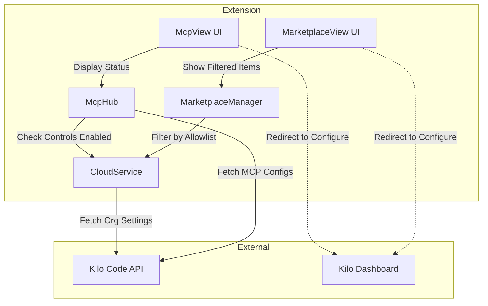
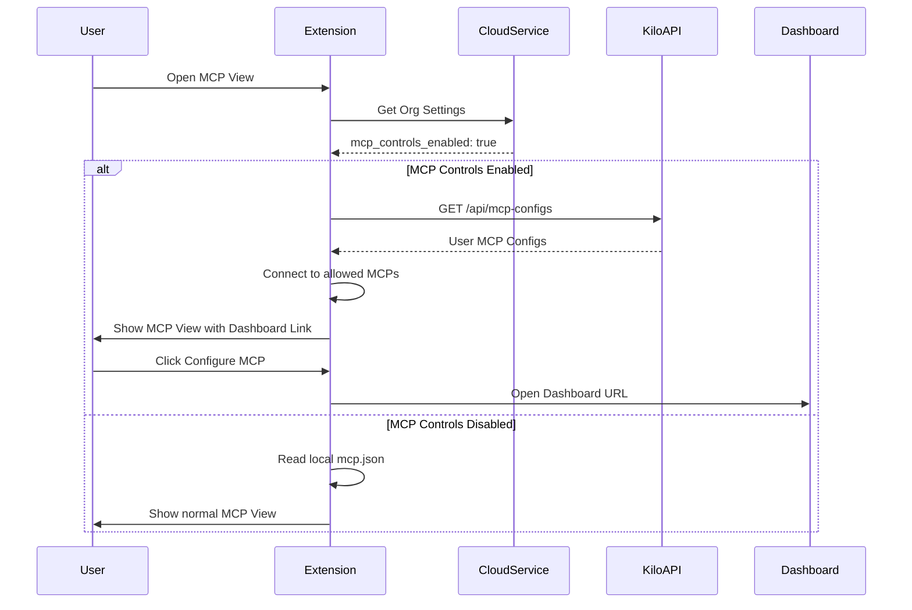

# Enterprise MCP Controls - Extension Implementation Plan

## Overview

This plan covers the VS Code extension changes required to support Enterprise MCP Controls. The backend/dashboard implementation is handled in a separate repository.

When Enterprise MCP Controls is enabled for an organization, the extension will:
1. Fetch MCP configurations from the Kilo Code API instead of local `mcp.json` files
2. Filter the MCP Marketplace to only show allowed servers
3. Ignore locally configured MCPs that are not on the organization's allowlist
4. Provide visual feedback for disallowed MCPs

## Current Architecture Analysis

### Existing Components

| Component | Location | Purpose |
|-----------|----------|---------|
| [`McpHub`](src/services/mcp/McpHub.ts) | `src/services/mcp/McpHub.ts` | Manages MCP server connections, reads from local `mcp.json` |
| [`MarketplaceManager`](src/services/marketplace/MarketplaceManager.ts) | `src/services/marketplace/MarketplaceManager.ts` | Handles marketplace items, already has org settings integration |
| [`CloudSettingsService`](packages/cloud/src/CloudSettingsService.ts) | `packages/cloud/src/CloudSettingsService.ts` | Fetches and caches organization settings |
| [`OrganizationSettings`](packages/types/src/cloud.ts) | `packages/types/src/cloud.ts` | Type definitions for org settings |
| [`KiloOrganizationSettings`](src/shared/kilocode/organization.ts) | `src/shared/kilocode/organization.ts` | Kilo-specific org settings schema |

### Existing Organization Settings Integration

The extension already has infrastructure for organization settings:
- [`CloudSettingsService`](packages/cloud/src/CloudSettingsService.ts) fetches settings from `/api/extension-settings`
- [`OrganizationSettings`](packages/types/src/cloud.ts:160-172) already includes `hiddenMcps`, `hideMarketplaceMcps`, and `mcps` fields
- [`MarketplaceManager.getMarketplaceItems()`](src/services/marketplace/MarketplaceManager.ts:37-89) already filters MCPs based on org settings

## Implementation Plan

### Phase 1: Type Definitions and Schema Updates

#### 1.1 Extend Organization Settings Schema

**File:** `packages/types/src/cloud.ts`

Add new fields to `organizationSettingsSchema`:

```typescript
// New fields to add to organizationSettingsSchema
mcp_controls_enabled: z.boolean().optional(),
mcp_controls_allowed_marketplace_servers: z.array(z.string()).optional(),
```

#### 1.2 Create MCP Controls Types

**File:** `packages/types/src/mcp-controls.ts` (new file)

```typescript
// Schema for organization member MCP configuration
export const organizationMemberMcpConfigSchema = z.object({
  mcp_id: z.string(),
  parameters: z.record(z.string(), z.string()),
})

export type OrganizationMemberMcpConfig = z.infer<typeof organizationMemberMcpConfigSchema>

// Response from API when fetching user's MCP configs
export const mcpControlsConfigResponseSchema = z.object({
  enabled: z.boolean(),
  allowedServers: z.array(z.string()),
  userConfigs: z.array(organizationMemberMcpConfigSchema),
})

export type McpControlsConfigResponse = z.infer<typeof mcpControlsConfigResponseSchema>
```

---

### Phase 2: MCP Hub Modifications

#### 2.1 Add MCP Controls Awareness to McpHub

**File:** `src/services/mcp/McpHub.ts`

Modify [`McpHub`](src/services/mcp/McpHub.ts:146) to check for enterprise MCP controls:

```typescript
// Add new private property
private mcpControlsEnabled: boolean = false
private allowedMcpServers: Set<string> = new Set()

// Add method to check if MCP controls are enabled
private async checkMcpControlsEnabled(): Promise<boolean> {
  if (!CloudService.hasInstance() || !CloudService.instance.isAuthenticated()) {
    return false
  }
  const orgSettings = CloudService.instance.getOrganizationSettings()
  return orgSettings?.mcp_controls_enabled ?? false
}

// Add method to get allowed servers
private async getAllowedMcpServers(): Promise<Set<string>> {
  const orgSettings = CloudService.instance.getOrganizationSettings()
  const allowed = orgSettings?.mcp_controls_allowed_marketplace_servers ?? []
  return new Set(allowed)
}
```

#### 2.2 Modify Server Connection Logic

**File:** `src/services/mcp/McpHub.ts`

Update [`connectToServer()`](src/services/mcp/McpHub.ts:675-913) to check allowlist:

```typescript
private async connectToServer(
  name: string,
  config: z.infer<typeof ServerConfigSchema>,
  source: "global" | "project" = "global",
): Promise<void> {
  // NEW: Check if MCP controls are enabled and server is allowed
  if (this.mcpControlsEnabled && source !== "api") {
    if (!this.allowedMcpServers.has(name)) {
      // Create a placeholder connection marked as disallowed
      const connection = this.createDisallowedConnection(name, config, source)
      this.connections.push(connection)
      return
    }
  }
  
  // ... existing connection logic
}
```

#### 2.3 Add Disallowed Connection State

**File:** `src/services/mcp/McpHub.ts`

Add new connection type for disallowed servers:

```typescript
export type DisallowedMcpConnection = {
  type: "disallowed"
  server: McpServer & { disallowedReason: "enterprise_policy" }
  client: null
  transport: null
}

export type McpConnection = ConnectedMcpConnection | DisconnectedMcpConnection | DisallowedMcpConnection
```

#### 2.4 Add API-Based Configuration Loading

**File:** `src/services/mcp/McpHub.ts`

Add method to load MCP configs from API when controls are enabled:

```typescript
private async loadMcpConfigsFromApi(): Promise<void> {
  if (!this.mcpControlsEnabled) return
  
  const token = CloudService.instance.getSessionToken()
  if (!token) return
  
  try {
    const response = await fetch(`${getKiloApiUrl()}/api/mcp-configs`, {
      headers: { Authorization: `Bearer ${token}` }
    })
    
    if (!response.ok) return
    
    const configs = await response.json()
    // Process and connect to API-provided MCP servers
    await this.updateServerConnections(configs.mcpServers || {}, "api")
  } catch (error) {
    console.error("Failed to load MCP configs from API:", error)
  }
}
```

---

### Phase 3: Marketplace Integration

#### 3.1 Update MarketplaceManager

**File:** `src/services/marketplace/MarketplaceManager.ts`

The [`MarketplaceManager`](src/services/marketplace/MarketplaceManager.ts:37-89) already has organization MCP filtering. Enhance it to support the allowlist:

```typescript
async getMarketplaceItems(): Promise<MarketplaceItemsResponse> {
  // ... existing code ...
  
  // NEW: Filter by MCP controls allowlist
  if (orgSettings?.mcp_controls_enabled && orgSettings?.mcp_controls_allowed_marketplace_servers) {
    const allowedIds = new Set(orgSettings.mcp_controls_allowed_marketplace_servers)
    marketplaceItems = marketplaceItems.filter(
      item => item.type !== "mcp" || allowedIds.has(item.id)
    )
  }
  
  // ... rest of existing code ...
}
```

---

### Phase 4: UI Changes

#### 4.1 Update MCP View for Enterprise Controls

**File:** `webview-ui/src/components/mcp/McpView.tsx`

Add enterprise controls awareness:

```typescript
// Add new state
const [mcpControlsEnabled, setMcpControlsEnabled] = useState(false)

// Show banner when MCP controls are enabled
{mcpControlsEnabled && (
  <div className="bg-vscode-inputValidation-infoBackground border border-vscode-inputValidation-infoBorder p-3 rounded mb-4">
    <div className="flex items-center gap-2">
      <span className="codicon codicon-info"></span>
      <span>{t("mcp:enterpriseControls.enabled")}</span>
    </div>
    <p className="text-sm mt-2">
      {t("mcp:enterpriseControls.description")}
    </p>
    <Button 
      variant="secondary" 
      onClick={() => openDashboard()}
      className="mt-2"
    >
      {t("mcp:enterpriseControls.configureMcp")}
    </Button>
  </div>
)}
```

#### 4.2 Add Visual Feedback for Disallowed MCPs

**File:** `webview-ui/src/components/mcp/McpView.tsx`

Update server rendering to show disallowed state:

```typescript
// In server list rendering
{server.disallowedReason === "enterprise_policy" && (
  <div className="flex items-center gap-2 text-vscode-descriptionForeground">
    <span className="codicon codicon-lock"></span>
    <span>{t("mcp:serverStatus.disallowedByPolicy")}</span>
  </div>
)}
```

#### 4.3 Update Marketplace View

**File:** `webview-ui/src/components/marketplace/MarketplaceView.tsx`

When MCP controls are enabled, show a link to the dashboard instead of the full marketplace:

```typescript
// Add conditional rendering
{mcpControlsEnabled ? (
  <div className="text-center p-8">
    <span className="codicon codicon-lock text-4xl mb-4"></span>
    <h3>{t("marketplace:enterpriseControls.title")}</h3>
    <p>{t("marketplace:enterpriseControls.description")}</p>
    <Button onClick={() => openDashboard()}>
      {t("marketplace:enterpriseControls.goToDashboard")}
    </Button>
  </div>
) : (
  // Existing marketplace content
)}
```

---

### Phase 5: State Management

#### 5.1 Add MCP Controls State to Extension Context

**File:** `webview-ui/src/context/ExtensionStateContext.tsx`

Add new state fields:

```typescript
// Add to state interface
mcpControlsEnabled: boolean
disallowedMcpServers: string[]

// Add to initial state
mcpControlsEnabled: false,
disallowedMcpServers: [],

// Handle new message type
case "mcpControlsState": {
  setMcpControlsEnabled(message.enabled)
  setDisallowedMcpServers(message.disallowedServers ?? [])
  break
}
```

#### 5.2 Add Message Types

**File:** `src/shared/ExtensionMessage.ts`

Add new message types:

```typescript
// Add to ExtensionMessage union
| { type: "mcpControlsState"; enabled: boolean; disallowedServers?: string[] }
```

---

### Phase 6: Translations

#### 6.1 Add Translation Keys

**File:** `src/i18n/locales/en/mcp.json`

```json
{
  "enterpriseControls": {
    "enabled": "Enterprise MCP Controls Enabled",
    "description": "Your organization manages MCP server access. Configure your MCP servers through the Kilo Code dashboard.",
    "configureMcp": "Configure MCP Servers"
  },
  "serverStatus": {
    "disallowedByPolicy": "Not allowed by organization policy"
  }
}
```

**File:** `src/i18n/locales/en/marketplace.json`

```json
{
  "enterpriseControls": {
    "title": "MCP Marketplace Managed by Organization",
    "description": "Your organization controls which MCP servers are available. Visit the dashboard to configure your MCP servers.",
    "goToDashboard": "Go to Dashboard"
  }
}
```

---

## Architecture Diagram



## Data Flow When MCP Controls Enabled



## Testing Strategy

### Unit Tests

1. **McpHub Tests**
   - Test `checkMcpControlsEnabled()` returns correct value based on org settings
   - Test `connectToServer()` creates disallowed connection when server not in allowlist
   - Test `loadMcpConfigsFromApi()` correctly processes API response

2. **MarketplaceManager Tests**
   - Test filtering by `mcp_controls_allowed_marketplace_servers`
   - Test empty allowlist behavior

3. **UI Component Tests**
   - Test MCP View shows enterprise controls banner when enabled
   - Test disallowed server visual feedback
   - Test marketplace redirect when controls enabled

### Integration Tests

1. Test full flow: org settings → McpHub → UI state
2. Test transition between controls enabled/disabled states
3. Test handling of API errors gracefully

## Migration Considerations

1. **Backward Compatibility**: When `mcp_controls_enabled` is false or undefined, behavior is unchanged
2. **Graceful Degradation**: If API calls fail, fall back to local config with warning
3. **Cache Invalidation**: Clear cached MCP configs when org settings change

## Security Considerations

1. All API calls use authenticated tokens from CloudService
2. Local `mcp.json` is ignored but not deleted when controls are enabled
3. Disallowed servers are never connected to, even if configured locally

## Files to Modify Summary

| File | Changes |
|------|---------|
| `packages/types/src/cloud.ts` | Add MCP controls fields to org settings schema |
| `packages/types/src/mcp-controls.ts` | New file for MCP controls types |
| `packages/types/src/index.ts` | Export new types |
| `src/services/mcp/McpHub.ts` | Add controls checking, API loading, disallowed state |
| `src/services/marketplace/MarketplaceManager.ts` | Filter by allowlist |
| `src/shared/ExtensionMessage.ts` | Add new message types |
| `src/shared/mcp.ts` | Add disallowed reason to McpServer type |
| `webview-ui/src/components/mcp/McpView.tsx` | Enterprise controls UI |
| `webview-ui/src/components/marketplace/MarketplaceView.tsx` | Dashboard redirect |
| `webview-ui/src/context/ExtensionStateContext.tsx` | New state fields |
| `src/i18n/locales/en/mcp.json` | New translation keys |
| `src/i18n/locales/en/marketplace.json` | New translation keys |

## Open Questions

1. **Dashboard URL**: What is the URL pattern for the MCP configuration page in the dashboard?
   - Assumed: `/organizations/:id/mcp-control`

2. **API Endpoint**: What is the exact endpoint for fetching user MCP configs?
   - Assumed: `GET /api/mcp-configs`

3. **Refresh Behavior**: How often should the extension poll for MCP config changes?
   - Recommendation: Use same interval as CloudSettingsService (30 seconds)

4. **Offline Behavior**: Should cached MCP configs be used when offline?
   - Recommendation: Yes, with a warning indicator
